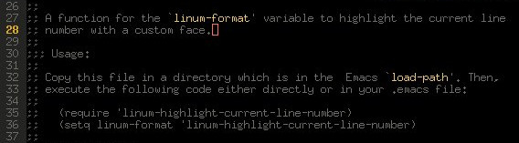

Linum Highlight Current Line Number
===================================

A Emacs function for the `linum-format` variable to highlight the
current line number with a custom face.



Installation
------------

Copy this file in a directory which is in the  Emacs `load-path`. Then,
execute the following code either directly or in your .emacs file:

```lisp
(require 'linum-highlight-current-line-number)
(setq linum-format 'linum-highlight-current-line-number)
```

Customization
-------------

**`M-x customize-group`** and then **`linum`**. Finally, **Linum Current Line Number Face**.
